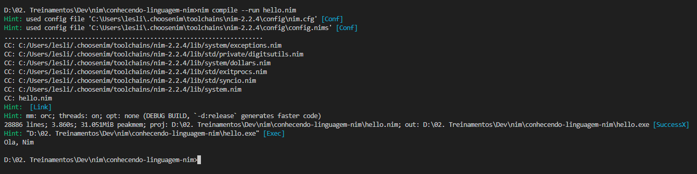

# Conhecendo a linguagem Nim
Claro! Aqui está o **passo a passo completo e correto para instalar o Nim** com suporte total no **Windows + VS Code**, incluindo integração com terminal e extensões.

---

## ✅ **Instalação completa do Nim no Windows (com VS Code)**

---

### 🟩 **1. Pré-requisitos**

* [x] Tenha o **PowerShell funcionando**
* [x] Tenha o **VS Code instalado**
* [x] De preferência, instale o [Chocolatey](https://chocolatey.org/install) (opcional, mas ajuda)

---

### 🟦 **2. Instalar o Nim com `choosenim` (recomendado)**

> Use o **PowerShell como administrador** (obrigatório para não dar erro)

#### 🔸 Passo a passo:

1. Pressione `Win + S` e digite `powershell`
2. Clique com o botão direito e escolha **Executar como administrador**
3. Rode este comando:

```powershell
iwr https://nim-lang.org/choosenim/init.ps1 -useb | iex
```

---

### 🔹 Durante a instalação

* Ele irá baixar o `choosenim`
* Perguntará qual versão você deseja instalar — escolha a **Stable**
* Ao final, o executável `nim` estará em:

```
C:\Users\seu_usuario\.nimble\bin
```

---

### 🟩 **3. Adicionar Nim ao PATH (se não foi feito automaticamente)**

Se o comando `nim -v` funcionar **no PowerShell**, mas **não no VS Code**, é porque o VS Code ainda **não reconhece o PATH atualizado**.

#### 🔧 Para corrigir:

1. Pressione `Win + R`, digite: `sysdm.cpl`
2. Vá na aba **Avançado** → clique em **"Variáveis de Ambiente..."**
3. Em **"Variáveis de usuário"** → selecione a variável `Path` → clique em **"Editar..."**
4. Adicione:

```plaintext
C:\Users\seu_usuario\.nimble\bin
```

> Troque `seu_usuario` pelo seu nome de usuário do Windows

5. Clique em **OK** em tudo

---

### 🟩 **4. Reabrir o VS Code corretamente**

> O VS Code precisa ser fechado e reaberto para pegar o novo `PATH`

* Feche o VS Code completamente
* Abra novamente
* Abra o terminal (`Ctrl + `` `)
* Rode:

```bash
nim -v
```

---

### 🟩 **5. Instalar extensão do Nim no VS Code**

1. Vá até a aba de extensões (`Ctrl + Shift + X`)
2. Pesquise por: `nim`
3. Instale a extensão oficial: **Nim (pela PMunch ou outras confiáveis)**

---

### 🟩 **6. Testar com um programa simples**

1. Crie um novo arquivo: `hello.nim`
2. Conteúdo:

```nim
echo "Olá, mundo do Nim!"
```

3. Rode no terminal:

```bash
nim compile --run hello.nim
```

---

### ✅ Pronto!

Você agora está com o Nim instalado corretamente no Windows, com terminal funcional e integração com o VS Code.

---

### 🔁 Resultado da primeira execução

